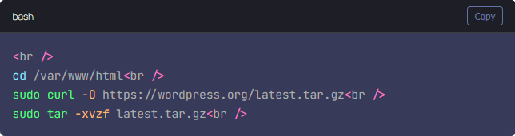

# Code Snippet WordPress

A WordPress plugin for managing and displaying code snippets on your website.

## 📋 Description

This plugin allows you to easily manage, organize, and display code snippets on your WordPress website. Perfect for developers, technical bloggers, and educators who want to share code examples with syntax highlighting.

## ✨ Features

- Syntax highlighting support
- Copy-to-clipboard functionality
- Multiple programming language support
- Responsive design
- Customizable styling options

## 🚀 Installation

1. Download the plugin zip file
2. Go to WordPress Admin > Plugins > Add New
3. Click "Upload Plugin" and select the downloaded zip file
4. Click "Install Now" and then "Activate"

## 🔧 Usage

### Adding a New Snippet

- Use the code below for a example:

[code-snippet language="bash" title="bash"]
cd /var/www/html
sudo curl -O https://wordpress.org/latest.tar.gz
sudo tar -xvzf latest.tar.gz
[/code-snippet]

## ⚙️ Configuration

Navigate to Code Snippets > Settings to:
- Change font

## 🔮 Future Changes

- Adding more fonts
- Customizable styling options

## 📝 License

This project is licensed under the MIT License - see the [LICENSE](LICENSE) file for details.

## 👥 Authors

- James Glover

## 🙏 Acknowledgments

- CursorAI used to generate the code for this plugin

